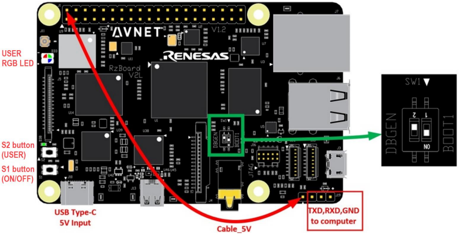

# RZ Board V2L IoTC Quick Start Guide

# 1. Introduction
This guide is designed to walk through the steps to connect the [RZBoard V2L](https://www.avnet.com/wps/portal/us/products/avnet-boards/avnet-board-families/rzboard-v2l) to the Avnet [IoTConnect platform](https://console.iotconnect.io/) and demonstrate the on-board AI functionality as shown in the webinar hosted by [TRIA](https://www.tria-technologies.com/) and [Avnet](https://avnet.com/iotconnect/renesas), December, 2024.  
For greatest reach, this guide is written to be followed on a Windows 10/11 host machine.

# 2. Hardware Requirements
* [RZBoard V2L](https://www.avnet.com/wps/portal/us/products/avnet-boards/avnet-board-families/rzboard-v2l)
* MicroSD Card (minimum 16GB)
* MicroSD Card Slot on PC or adapter
* USB Type-C Cable
* Ethernet Cable
* [USB to TTL Serial Cable](https://www.amazon.com/s?k=usb+to+ttl+serial+cable)
* [Hook test cable](https://www.amazon.com/s?k=hook+test+cable) (or something similar)
* [USB Webcam](https://www.amazon.com/s?k=usb+webcam) - 1080p is sufficient
* [Micro HDMI to HDMI](https://www.amazon.com/s?k=micro+hdmi+to+hdmi)

# 3. Hardware Setup
Set up the device by connecting the following items:
* Connect the USB to Serial port adapter from the PC to the board header (See TX, RX and GND labels in the reference image below.)
* Connect the Jumper Wire
* Connect the Ethernet cable from the board to you LAN switch/router
* Connect the Micro HDMI cable to a monitor
* Connect the the Webcam to a USB port on the board
* Connect the USB-C cable to the board, but DON'T connect your PC yet

Configure the DIP switches:  
1 = ON  
2 = OFF  

Reference Image  



# 4. Install Software
* Download and Install [BalenaEtcher](https://www.balena.io/etcher)
* Download and Install [Git for Windows](https://gitforwindows.org/)
* Download and Install [Python for Windows](https://www.python.org/downloads/)
> [!IMPORTANT]
> Ensure to select the add "PYTHON" to the PATH variable option during setup.
 
 
# 5. Flash Image to the Board

1. Download the [RZBoard V2L QuickStart Package](https://iotconnect-sdk-images.s3.amazonaws.com/MPU/hardknott/rz/rzboard-iotc-demo.zip) to a project directory such as `C:\Renesas\RZboardV2L\`
2. Unzip the package by Right-Clicking, select "Extract All..." and extract here `C:\Renesas\RZboardV2L\` (Do not extract to a sub-folder)
3. Flash the `.wic` file to an SD Card:
    * Insert the SD Card into your computer directly, or via an adapter
    * Open **Balena Etcher**.
    * Click **"Flash from file"** and select the `.wic` extracted from the .zip
    * Choose the SD Card as the **Target**
    * Click **"Flash!"** to start the process.  This will take 5-10 minutes.
> [!NOTE]
> Depending on PC permission, the flash process might fail at the verification step.  You can safely ignore this message.
    

# 6. Download and Configure the Flash Utility  
The Flash Utility will be used to setup the bootloader on the board:  
1. Navigate the project directory `C:\Renesas\RZboardV2L\`
2. Right-Click in this folder and select "Open Git Bash here"
3. Clone the latest flash utility from GitHub:  
```bash
git clone https://github.com/Avnet/rzboard_flash_util.git
```

4. Install the Python Requirements:
```bash
pip install -r rzboard_flash_util/requirements.txt
```

5. Flash the bootloader to the device:
>[!IMPORTANT]
>Replace `COM00` with the COM port assigned to your USB to Serial adapter.  This can be found in the Device Manager.
```bash
  python rzboard_flash_util/flash_rzboard.py --serial_port COM00 --bootloader --image_path .
```

6. When prompted, connect the USB cable to your PC.
7. Press and hold the power button for a couple seconds until the LED turns on. The script will begin flashing your bootloader.

> [!NOTE]
> This process will take about 5 minutes and progress is only updated periodically.

8. Once the bootloader is complete, remove the **USB-C power** and the **jumper wire**.
9. Set the DIP switches to boot from the SD Card:  
1 = OFF  
2 = ON  

10. Insert the **SD Card** and re-connect the **USB-C power**
11. Press and hold the board power button for a couple seconds to turn it on.

# 7. Download Configuration Script  
1. Download the device configuration script [onboard.zip](https://github.com/avnet-iotconnect/meta-iotconnect-docs/blob/main/QuickStart/Renesas/RZBoard-V2L/demo-iotc-ai-camera/scripts/onboard.zip?raw=1)
2. Extract the contents to the `C:\Renesas\RZboardV2L\` project folder  

You should now have a new folder called onboard here: `C:\Renesas\RZboardV2L\onboard`  

# 8. Cloud Account Setup
An IoTConnect account with AWS backend is required.  If you need to create an account, a free trial subscription is available.

[IoTConnect Free Trial (AWS Version)](https://subscription.iotconnect.io/subscribe?cloud=aws)

> [!NOTE]
> Be sure to check any SPAM folder for the temporary password after registering.

See the IoTConnect [Subscription Information](https://github.com/avnet-iotconnect/avnet-iotconnect.github.io/blob/main/documentation/iotconnect/subscription/subscription.md) for more details on the trial.

# 9. IoTConnect Device Template Setup
A Device Template define the type of telemetery the platform should expect to recieve.
* Download the premade device template [device_template_RZboard_AI.json](Renesas/RZBoard-V2L/demo-iotc-ai-camera/templates/device_template_RZboard_AI.json?raw=1) (**MUST** Right-Click and "Save-As" to get the raw json file)
* Log-in the [console.iotconnect.io](https://console.iotconnect.io/login) using the credentials recieved when registering. 
* Import the template into your IoTConnect instance. (A guide on [Importing a Device Template](https://github.com/avnet-iotconnect/avnet-iotconnect.github.io/blob/main/documentation/iotconnect/import_device_template.md) is available or for more information, please see the [IoTConnect Documentation](https://docs.iotconnect.io/iotconnect/) website.)

# 10. Create a Device in IoTConnect


1.  **Click** the Device icon and the "Device" sub-menu
2. At the top-right, click on the "Create Device" button
3. Enter `RZboardV2L` for both **Unique ID** and **Device Name**
4. Select the entity in the drop-down (if this is a new/trial account, there is only one option)
5. Select the template ("RZBai") from the template dropdown box
6. Leave the Device Certificate as "Auto-generated"
7. Click Save & View
8. Click the "Download device configuration" icon at the top-right and save the file "iotcDeviceConfig.json" into the `..\onboard\` folder
9. Click the link for "Connection Info" and then the icon in the top-right and save the file "RZboardV2L-certificates.zip" into the `..\onboard\` folder

---

# 11. Obtain Board IP address
The script in the next sction will need to connect to the board update files and configure connection settings.
To accomplish this task, the IP Address of the board is required.  This can be obtained in a couple of ways:
1. Login to your router and find the DHCP lease associated with hostname `rzboard`
2. Connect to the board via a serial terminal such as https://googlechromelabs.github.io/serial-terminal/
   * Look for a device that matches the type of USB to Serial adapter you have
   * Press `Enter` to obtain a login prompt
   * Enter `root` for the username and `avnet` for the password
   * Type `ifconfig` and look for the IP address next to **eth0**

* Take note of the IP Address

# 12. Running the Device Setup Script

1. Navigate to the "onboard" directory in windows explorer
2. Right-click in the folder and select "Open Git Bash here"
3. Ensure you are in this directory `/c/Renesas/RZboardV2L/onboard`
4. Enter the following command start the setup script:  
```
./initial-device-config-and-update.sh
```
5. Enter the IP address of the board and press `Enter`
6. If prompted to continue connecting, type `yes` then `Enter`
7. When prompted to enter a password, type `avnet` then `Enter` (This will happen 3 times)
8. Assuming you placed the `iotcDeviceConfig.json` in the onboard folder, just hit Enter
9. Assuming you placed the `RZboardV2L-certificates.zip` in the onboard folder, just hit Enter

After the script completes, you will be presented with some information and a prompt to open an SSH session.

10. Type `yes` and then `Enter`
11. To start the IoTConnect application copy/paste the following command:
```bash
~/iotc-application.sh
```

# 13. Import a Dashboard
The interactive demo can be loaded by using the Dynamic Dashboard feature of IoTConnect.  
The pre-configured demo dashboard is available here: [dashboard_export_RZBOARD_AI.json](Renesas/RZBoard-V2L/demo-iotc-ai-camera/templates/dashboard_export_RZBOARD_AI.json?raw=1) (**must** Right-Click the link, Save As)

* **Download** the template then select "Create Dashboard" from the top of the IoTConnect portal
* **Select** the "Import Dashboard" option and **Select** the *Template* and *Device Name* used previously 
* **Input** a name and complete the import

You will now be in the dashboard edit mode. You can add/remove widgets or just click **Save** in the upper-right to exit the edit mode.

# 14. Using the Demo

Use the colored buttons or the commands in the "Cloud 2 Device" menu to start the various AI models.

# 15. Further Learning
For more advanced setup instructions, Yocto Project configurations, and other board features, refer to the following documents:  
- [RZ Board Linux Yocto User Manual v2.3](https://www.avnet.com/wps/wcm/connect/onesite/9fe02bc9-8335-4da2-924a-1bdde941e534/RzBoard-Linux-Yocto-UserManual-v2.3.pdf): Direct PDF Link
- [Avnet RZ Board V2L Product Page](https://www.avnet.com/wps/portal/us/products/avnet-boards/avnet-board-families/rzboard-v2l/): Product Page (with access to additional guides and resources)

# 16. Resources
* [Webinar Slides](https://www.avnet.com/iot)
* [Purchase the RZboardV2L](https://www.avnet.com/wps/portal/us/products/avnet-boards/avnet-board-families/rzboard-v2l)
* [Additional Renesas QuickStart Guides](https://www.avnet.com/iotconnect/renesas)
* [IoTConnect Overview](https://www.iotconnect.io/)
* [IoTConnect Knowledgebase](https://help.iotconnect.io/)
